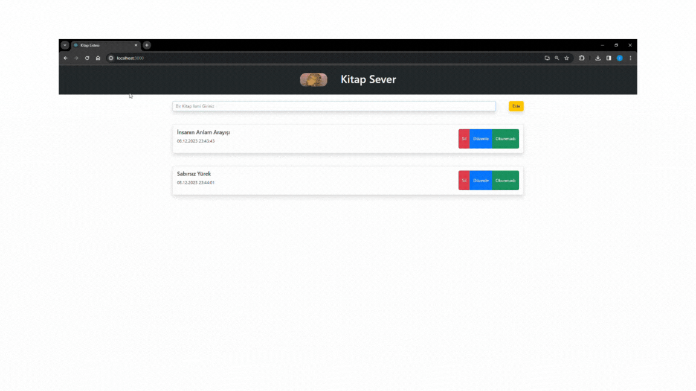

# react-kitap-sever
# react-kitap-sever
<h1>Bu Bir Crud Uygulamasıdır</h1>

Bu uygulamada;

React Bootstrap kütüphaneleri kullanılmıştır. 

Projede input boş olduğu halde ekleme yapılırsa uyarı verir.

Bir kitap eklenir, güncellenir veya silinebilir.

Okunup okunmadığı bilgisi işaretlenebiliyor.

proje gifini inceleyebilirsiniz;

